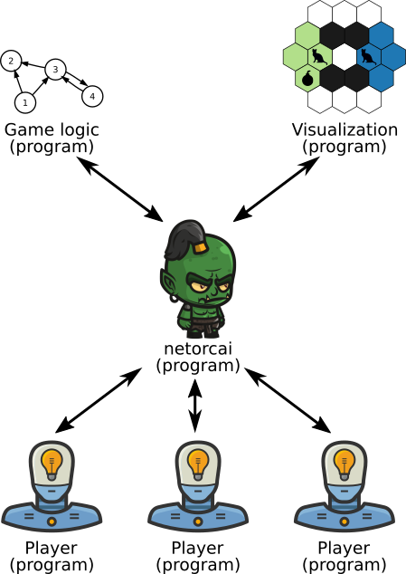

netorcai
========

netorcai is a network orchestrator for artificial intelligence games.
It splits a classical game server process into two processes, allowing to
develop various games in any language without having to manage all
network-related issues about the clients.

[netorcai's documentation][readthedocs] gives installation instructions,
defines the netorcai metaprotocol and more.

[readthedocs]: https://netorcai.readthedocs.io
